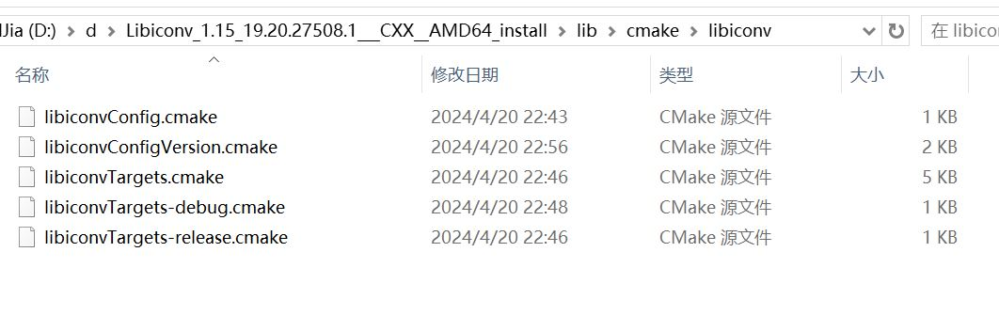

### update list:

I have added cmake configure files , which are some supports for this LibIconv。

### Thanks:

Thanks To vovythevov!

### ref:

This is a CMake'ified version of libiconv.
For the libiconv original README, see README.libiconv

Credits:
 The libiconv library: http://www.gnu.org/software/libiconv/
 The how-to build libiconv on windows: http://www.codeproject.com/Articles/302012/How-to-Build-libiconv-with-Microsoft-Visual-Studio